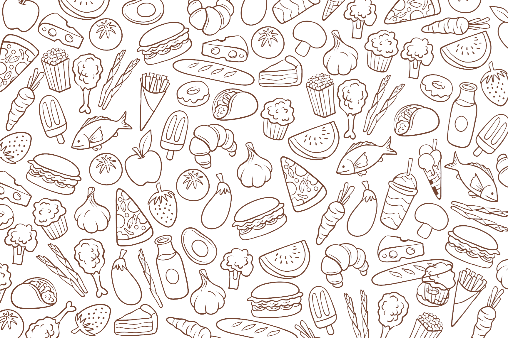

 # NoCountry: C20-48-t-Python-React

Proyecto: RecetApp

Versión: 1.0
Fecha:20/09/2024

Es un aplicación web responsive, donde cualquier usuario puede consultar recetas y siendo un usuario registrado, además podrá compartir sus recetas, pudiendo recibir comentarios y calificaciones de otros usuarios. ‌ Objetivos y funciones del Sitio Web: Permitir a los usuarios, la búsqueda de recetas a partir de los ingredientes, descripción o categoría de la misma. Los usuarios podrán crear y compartir sus propias recetas, una vez que estén registrados en el sitio web. Las recetas podrán ser visualizadas por otros usuarios, y para quienes estén registrados, tendrán la opción de comentar y realizar las puntuaciones de las mismas. En el perfil de usuario podrá crear una lista de sus recetas favoritas, además de visualizar las recetas que ha publicado, pudiendo editar las mismas. Un usuario registrado podrá seguir a otros. Además, contarán con la opción de dejar de seguirlos.

## 🔗Enlaces importantes

•	Documentación del Proyecto
•	Guía de Estilo del Proyecto
•	Organización del Proyecto
•	GitHub del Proyecto
•	Video de Presentación
•	Despliege de Backend
•	Sitio Web

## Authors
| Avatar                        | Nombre          | Rol                    | GitHub & Redes                                                                                                                                                                                          |
| ----------------------------- | --------------- | ---------------------- | ------------------------------------------------------------------------------------------------------------------------------------------------------------------------------------------------------- |
|  | Juan Manuel Sanjurjo   | Backend Developer  /Fronted Developer  |           |
|  | Isaias Romero| Fronted Developed                   |     |
|  | Matias Badano  | Backend Developer /QA    |  )           
|  | Prscila Ewens| QA    |       |
|  | Adolfo Sánchez| Frontend Developer    |       |
|  | Iván Capaquira| UX/UI    |       |

UX/UI: Iván Capaquira
QA: Matías Badano - Priscila Ewens 
Backend: Matias Badano - Juan Manuel Sanjurjo
Frontend:  Adolfo Sanchez - Isaías Romero - Juan Manuel Sanjurjo

## Tecnologias utilizadas

·Backend: Spring Boot
·Base de Datos: MySQL
·Autenticación: JWT (JSON Web Token) 
.Dependencias: çSpring Data JPA, Spring Security,  
 Spring Web, Lombok

## Imagenes del Proyecto

## Color Reference

| Color             | Hex                                                                |
| ----------------- | ------------------------------------------------------------------ |
| Example Color |  
